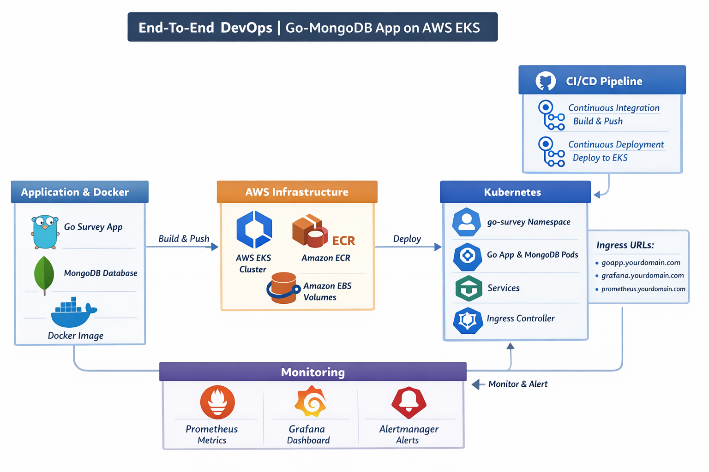

# 🚀 End-to-End DevOps Project on AWS (EKS)


# 🚀 Go Survey App — Cloud-Native Deployment on AWS
 
A full cloud-native deployment of a **Go-based Survey Application** with MongoDB, running on Amazon EKS with a fully automated DevOps pipeline.
 
---
 
## 📌 Project Overview
 
This project demonstrates a complete DevOps workflow — from infrastructure provisioning to containerization and Kubernetes deployment — all automated with a single shell script.
 
**Application:** A survey web app built with **Go** and **MongoDB**  
**Infrastructure:** Fully managed on **AWS** using **Terraform**  
**Orchestration:** **Kubernetes (EKS)** with auto-scaling and load balancing  
**Monitoring:** **Prometheus + Grafana** via Helm
 
---
 
## 🏗️ Architecture
 
```
                        ┌─────────────────────────────────┐
                        │           AWS Cloud              │
                        │                                 │
         Internet ──────►  Load Balancer (ELB)            │
                        │         │                       │
                        │    ┌────▼────────────────┐      │
                        │    │   EKS Cluster        │      │
                        │    │                     │      │
                        │    │  ┌──────────────┐   │      │
                        │    │  │  Go App Pods │   │      │
                        │    │  └──────┬───────┘   │      │
                        │    │         │            │      │
                        │    │  ┌──────▼───────┐   │      │
                        │    │  │  MongoDB Pod │   │      │
                        │    │  │  (EBS PVC)   │   │      │
                        │    │  └──────────────┘   │      │
                        │    └─────────────────────┘      │
                        │                                 │
                        │    ┌─────────────────────┐      │
                        │    │  Monitoring Stack    │      │
                        │    │  Prometheus+Grafana  │      │
                        │    └─────────────────────┘      │
                        └─────────────────────────────────┘
```
 
---
 
## 🛠️ Tech Stack
 
| Tool | Purpose |
|------|---------|
| **Go** | Application backend |
| **MongoDB** | Database |
| **Docker** | Containerization |
| **Amazon ECR** | Container registry |
| **Amazon EKS** | Kubernetes cluster |
| **Terraform** | Infrastructure as Code |
| **Helm** | Kubernetes package manager |
| **Prometheus** | Metrics collection |
| **Grafana** | Monitoring dashboards |
| **AWS EBS CSI** | Persistent storage for MongoDB |
| **Cluster Autoscaler** | Auto-scaling EKS nodes |
 
---
 
## 📁 Project Structure
 
```
.
├── Go-app/                  # Go application source code
├── k8s/
│   ├── app.yml              # Go app Deployment + Service
│   └── database.yml         # MongoDB Deployment + Service + PVC
├── terraform/
│   ├── main.tf              # Terraform entry point & providers
│   ├── eks.tf               # EKS cluster, node groups, addons
│   ├── vpc.tf               # VPC, subnets, NAT gateway
│   └── variables.tf         # Input variables
└── build.sh                 # Full automation script
```
 
---
 
## ⚙️ Infrastructure Details
 
### VPC
- CIDR: `10.0.0.0/16`
- 3 Availability Zones (`eu-central-1a`, `eu-central-1b`, `eu-central-1c`)
- Public & Private subnets
- Single NAT Gateway
 
### EKS Cluster
- Kubernetes version: `1.29`
- Node instance type: `m7i-flex.large`
- Min nodes: `1` / Max nodes: `3` / Desired: `2`
- Addons: `coredns`, `kube-proxy`, `vpc-cni`, `aws-ebs-csi-driver`
 
### Kubernetes Resources
- **Namespace:** `go-survey`
- **Go App:** 2 replicas, LoadBalancer service on port 80
- **MongoDB:** 1 replica, 3Gi EBS persistent volume
- **Monitoring:** Prometheus + Grafana in `monitoring` namespace
 
---
 
## 🚀 How to Run
 
### Prerequisites
- AWS CLI configured
- Terraform installed
- kubectl installed
- Helm installed
- Docker installed
 
### One Command Deployment
 
```bash
./build.sh
```
 
This script will:
1. Add Helm repos
2. Provision AWS infrastructure with Terraform
3. Update kubeconfig
4. Deploy Prometheus + Grafana monitoring stack
5. Build and push Docker image to ECR
6. Deploy app to Kubernetes
7. Output the application URL
 
---
 
## 🌐 Access the Application
 
After running `build.sh`, the script outputs:
 
```
Use this URL:
http://<load-balancer-dns>
```
 
---
 
## 📈 Monitoring
 
```bash
# Grafana
kubectl port-forward svc/kube-prometheus-stack-grafana -n monitoring 3000:80
 
# Prometheus
kubectl port-forward svc/kube-prometheus-stack-prometheus -n monitoring 9090:9090
```
 
- Grafana: `http://localhost:3000` (admin / prom-operator)
- Prometheus: `http://localhost:9090`
 
---
 
## 🧹 Cleanup
 
```bash
cd terraform
terraform destroy -auto-approve
```
 
Verify everything is deleted:
 
```bash
aws eks list-clusters --region eu-central-1
aws ecr describe-repositories --region eu-central-1
aws ec2 describe-instances --region eu-central-1 \
  --query "Reservations[*].Instances[?State.Name!='terminated']"
```
 
---
